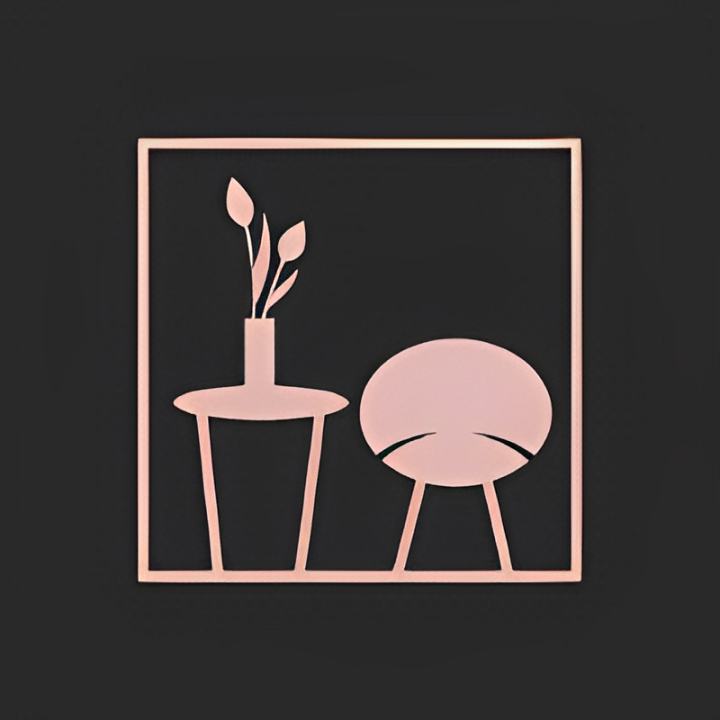
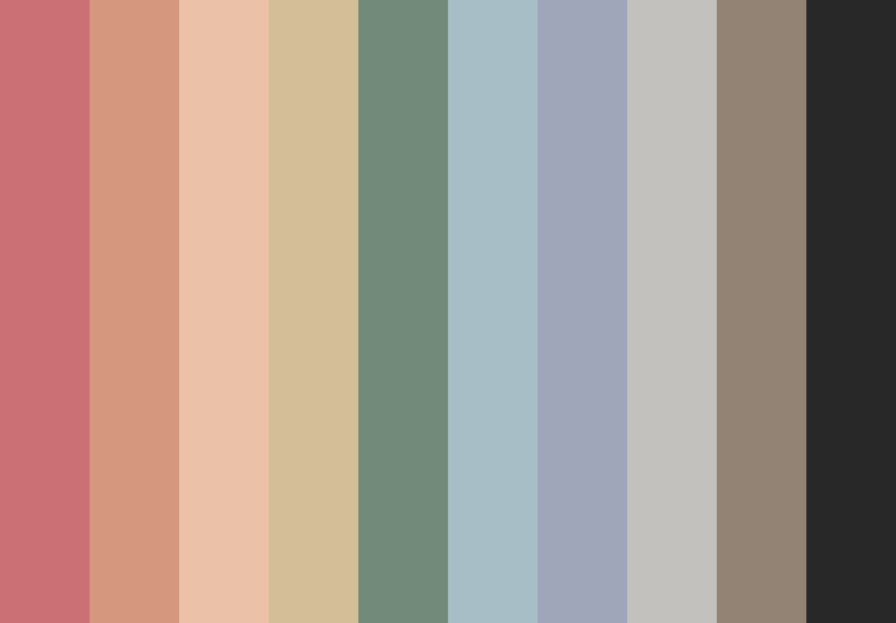
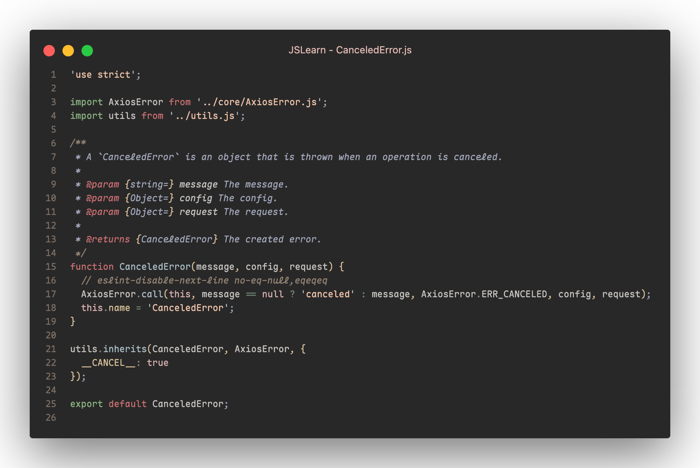

<h1 align="center">
   
  
   
  Morandi Gruv
   
</h1>

<h4 align="center">low saturation,senere,natural and smooth colors</h4>

  
  

## Palette

 

  

## Screenshots

  

## About

Morandi Gruv is a theme aimed to create **tranquility,elegant vibes through a grayish tone** by combing the famous **Morandi Color Plalette** with another VsCode theme called **GruvBox Material Theme**.

Giorgio Morandi(1890-1964) is an Italian Impressionist art painter.His paintings are characterized by vibrant and luminous colors.

Morandi Gruv pursues the goal of low saturation,senere,natural and smooth colors.
